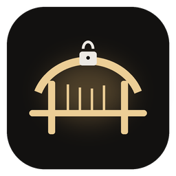
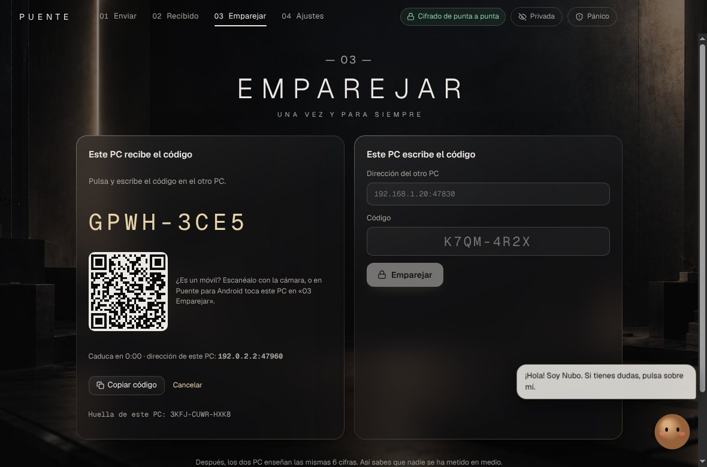
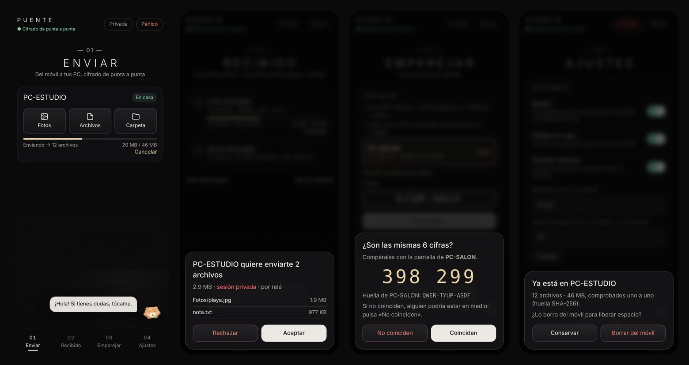
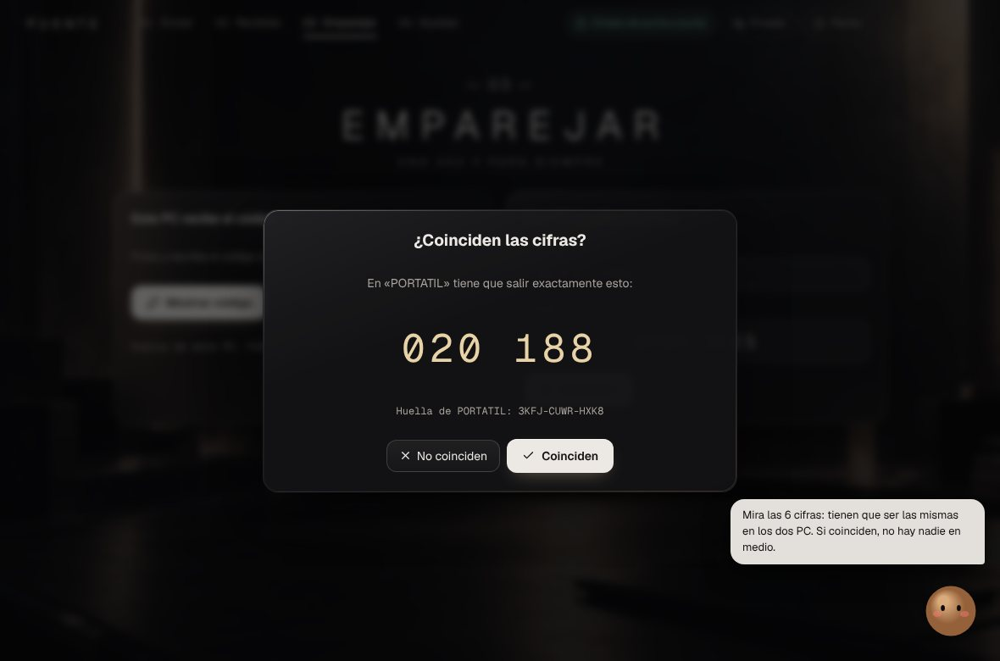
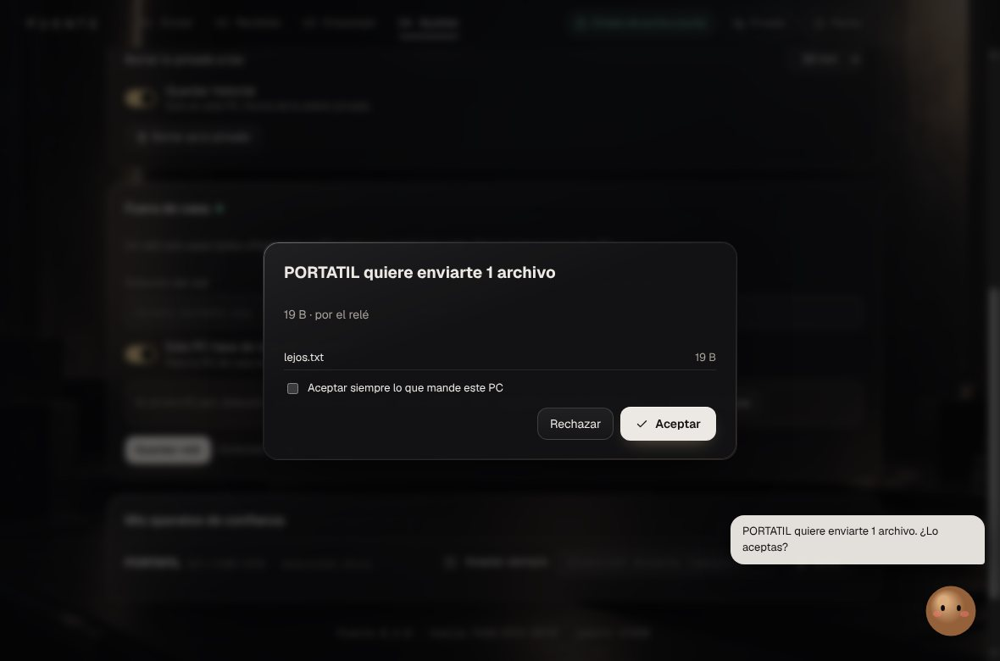

<p align="center">
  
</p>

<h1 align="center">Puente</h1>

<p align="center">
  <b>Pasa archivos entre tus PC con Windows y tu móvil Android — en casa o fuera — cifrados de punta a punta.</b><br>
  Sin nube. Sin cuentas. Sin servidores de nadie.
</p>

<p align="center">
  <a href="https://github.com/TeamLabStudios/puente/releases/latest"></a>
  <a href="https://github.com/TeamLabStudios/puente/actions/workflows/verificar.yml"></a>
  
  
  <a href="LICENSE"></a>
</p>

<p align="center"><a href="README.en.md">English</a> · <a href="PROTOCOLO.md">Protocolo y seguridad</a> · <a href="#descargar">Descargar</a></p>

<p align="center"></p>

---

## Por qué Puente

- 🔐 **Cifrado de verdad, no «cifrado en tránsito»**. Cada conexión usa **Noise XX** (el marco de WireGuard y de WhatsApp) con claves nuevas cada vez y **AES-256-GCM**. Si alguien cambia un solo bit por el camino, se nota y se corta.
- 🔢 **Sin nadie en medio: 6 cifras.** Al emparejar, las dos pantallas enseñan un número que sale de las claves que se acaban de intercambiar. Si coinciden, estás hablando con tu aparato y con nadie más. Se hace **una vez** y luego os reconocéis solos.
- 🏠 **En casa y fuera de casa.** En tu WiFi va directo. Fuera, por un **relé que tú controlas** — incluso tu propio PC de casa hace de relé con un interruptor. El relé solo ve bytes cifrados: ni archivos, ni nombres, ni quién eres.
- 📱 **PC ↔ móvil.** App de Android con el mismo protocolo, byte a byte: «Compartir → Puente» desde cualquier app, notificación con **Aceptar / Rechazar**, lo recibido en *Descargas › Puente*.
- 🕶️ **Sesión privada.** Lo que recibes no va a Descargas, no queda en el historial y **se borra solo** a los minutos que elijas.
- 🧯 **Botón del pánico.** Corta todas las conexiones, cancela envíos y borra lo privado al instante.
- 🧹 **Borrar del móvil lo enviado** (opcional): solo cuando el PC confirma que **cada archivo** llegó idéntico (huella SHA-256). Nunca si falla, se corta o va en privado.
- ♻️ **Si se corta, sigue donde lo dejó** y comprueba al final que el archivo es idéntico.
- 📁 **Carpetas enteras**, miles de archivos de una vez.
- ☁️ **Nada en la nube.** No hay cuenta, ni servidor central, ni telemetría.
- 🐻 **Nubo**, una mascota que te explica todo sin tecnicismos (en español).

## Cómo se compara

Puente no es el único: hay herramientas buenísimas. Esto es lo que lo hace distinto (datos de la documentación de cada proyecto, octubre de 2026):

| | **Puente** | LocalSend | PairDrop | Magic Wormhole |
|---|---|---|---|---|
| Fuera de tu red | ✅ relé propio (o tu PC de casa) | ❌ solo red local | ✅ con su servidor + TURN | ✅ con sus servidores |
| Servidor de terceros necesario | **No** | No | Sí (o montar el tuyo) | Sí por defecto (o montar el tuyo) |
| Comprobar que no hay nadie en medio | **6 cifras** derivadas del saludo cifrado | huella del certificado / PIN opcional | clave de emparejado a través del servidor | código de un solo uso (PAKE) |
| Recuerda tus aparatos | ✅ | ✅ | ✅ | ❌ código nuevo cada vez |
| Sesión privada que se autodestruye | ✅ | — | — | — |
| Botón del pánico | ✅ | — | — | — |
| Borrar del origen tras verificar SHA-256 | ✅ (Android) | — | — | — |
| Plataformas | Windows, Android | Windows, macOS, Linux, Android, iOS | navegador | terminal (Windows, macOS, Linux) |

**Con honestidad:** si solo quieres pasar algo dentro de tu WiFi entre muchos sistemas distintos, LocalSend es más maduro y está en más plataformas. Puente es para cuando quieres **lo mismo en casa y fuera, sin depender de nadie, con verificación anti-intrusos y control total sobre lo que queda**.

## Capturas

<p align="center"></p>

<table>
<tr><td></td><td></td></tr>
<tr><td align="center"><sub>Las 6 cifras: si coinciden, no hay nadie en medio</sub></td><td align="center"><sub>Fuera de casa, por tu relé, y siempre te pregunta</sub></td></tr>
</table>

## Descargar

En **[Releases](https://github.com/TeamLabStudios/puente/releases/latest)**:

- `Puente-X.Y.Z-instalador.exe` — Windows 10/11 (64 bits).
- `Puente-X.Y.Z-android.apk` — Android 8 o superior.
- `SHA256SUMS.txt` — comprueba lo descargado (`certutil -hashfile archivo SHA256`).

**Empezar:** en el PC, *03 Emparejar → Mostrar código*. En el móvil (o en otro PC), escanea el QR o escribe el código, compara las 6 cifras y listo.

**Fuera de casa:** en tu PC de casa, *Ajustes → Este PC hace de relé* y abre el puerto 47840 (TCP) en el router. O monta el relé en cualquier servidor con Node.js:

```bash
node electron/relay-server.cjs --port 47840 --key una-clave-larga
```

## Seguridad

- Protocolo completo y modelo de amenazas: **[PROTOCOLO.md](PROTOCOLO.md)**.
- Noise_XX_25519_AESGCM_SHA256 comprobado con los **vectores oficiales**; X25519 con los del **RFC 7748**; el móvil probado contra el PC real en los dos sentidos.
- **Fuzzing** de nombres, rutas, mensajes trucados de un aparato emparejado, JSON roto y ajustes raros.
- La interfaz pide acciones y el motor decide qué rutas usa (nunca rutas desde la ventana); CSP estricta en PC y móvil.
- En Android, claves en el almacén de claves del sistema; si falla, no se guarda nada en claro.
- Revisión de una auditoría externa y lo que se cambió: **[RESPUESTA-AUDITORIA.md](RESPUESTA-AUDITORIA.md)**.
- ¿Has encontrado un fallo? Lee **[SECURITY.md](SECURITY.md)**.

> Puente es un proyecto joven (0.x). El protocolo es estándar y está probado, pero todavía no ha pasado una auditoría independiente completa.

## Compilar

```bash
npm install
bash scripts/verificar.sh        # todas las pruebas (Node, JVM, pantallas, dos PC con Electron)
npm run dist                     # instalador de Windows (solo si todo pasa)

# Android sin Gradle: aapt2 + javac + dx + apksigner (API 23, minSdk 26)
PUENTE_KEYSTORE=… PUENTE_KEYSTORE_PASS=… android/build.sh 0.3.0 3
```

La mascota usa un motor 3D que no se incluye en este repositorio (`public/vendor/fluffy-friends.js`); sin él, Nubo aparece como una burbuja «?» y todo lo demás funciona igual.

## Hoja de ruta

- Menú contextual de Windows «Enviar con Puente».
- Reconexión automática si se corta la WiFi.
- Confianza temporal (una vez / 24 h / siempre).
- Huella o PIN en el móvil para lo privado.
- Android con Gradle y targetSdk actual; firma de código en Windows.

¿Ideas? Abre un *issue*. ¿Te gusta? Una ⭐ ayuda muchísimo a que más gente lo encuentre.

## Licencia

[MIT](LICENSE) © TeamLabStudios
